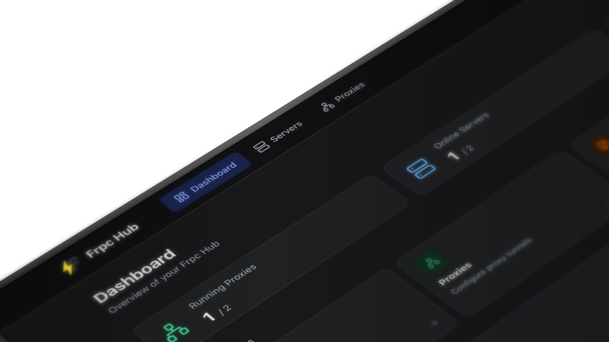

<!-- PROJECT SHIELDS -->

[![Forks][forks-shield]][forks-url]
[![Stargazers][stars-shield]][stars-url]
[![Issues][issues-shield]][issues-url]
[![Apache License][license-shield]][license-url]

  <b>English</b> | <a href="README_zh.md">简体中文</a>

> **Project Renamed:** This project was previously known as **frpc-hub** and has been officially renamed to **Podux**.
> The repository URL and all references have been updated accordingly.

<!-- PROJECT LOGO -->
 

  

<h3 align="center">Podux</h3>

  

    <strong>Podux</strong> is the web UI frpc always needed.
     
    Manage all your clients, proxies, and connections from one place. No terminal. No config editing.
      
    <a href="https://podux.io/en/guide/getting-started.html"><strong>🚀 Quick Start</strong></a>
    &nbsp;&nbsp;·&nbsp;&nbsp;
    <a href="https://podux.io/"><strong>📖 Documentation</strong></a>
    &nbsp;&nbsp;·&nbsp;&nbsp;
    <a href="https://github.com/luckjiawei/podux/issues">🐛 Report Bug</a>
    &nbsp;&nbsp;·&nbsp;&nbsp;
    <a href="https://github.com/luckjiawei/podux/issues">✨ Request Feature</a>
  

   

  

    <strong>✅ Multi-server management</strong> &nbsp;·&nbsp;
    <strong>📊 Real-time dashboard</strong> &nbsp;·&nbsp;
    <strong>🌐 Network monitoring</strong> &nbsp;·&nbsp;
    <strong>🚀 One-click auto-start</strong> &nbsp;·&nbsp;
    <strong>⚡ High performance</strong> &nbsp;·&nbsp;
    <strong>🐳 Docker ready</strong> &nbsp;·&nbsp;
    <strong>🎨 Modern UI</strong> &nbsp;·&nbsp;
  

## Screenshot

## Milestones

- 2026-03-03: Released v0.1.0
- 2026-03-12: Released v0.1.1
- 2026-03-12: Released v0.1.2
- 2026-03-16: Released v0.1.3
- 2026-03-25: Released v0.1.4
- 2026-03-26: Released v0.1.5

## License

[MIT](LICENSE)

## Star History

<!-- MARKDOWN LINKS & IMAGES -->

[forks-shield]: https://img.shields.io/github/forks/luckjiawei/podux.svg?style=for-the-badge
[forks-url]: https://github.com/luckjiawei/podux/network/members
[stars-shield]: https://img.shields.io/github/stars/luckjiawei/podux.svg?style=for-the-badge
[stars-url]: https://github.com/luckjiawei/podux/stargazers
[issues-shield]: https://img.shields.io/github/issues/luckjiawei/podux.svg?style=for-the-badge
[issues-url]: https://github.com/luckjiawei/podux/issues
[license-shield]: https://img.shields.io/github/license/luckjiawei/podux.svg?style=for-the-badge
[license-url]: https://github.com/luckjiawei/podux/blob/main/LICENSE
